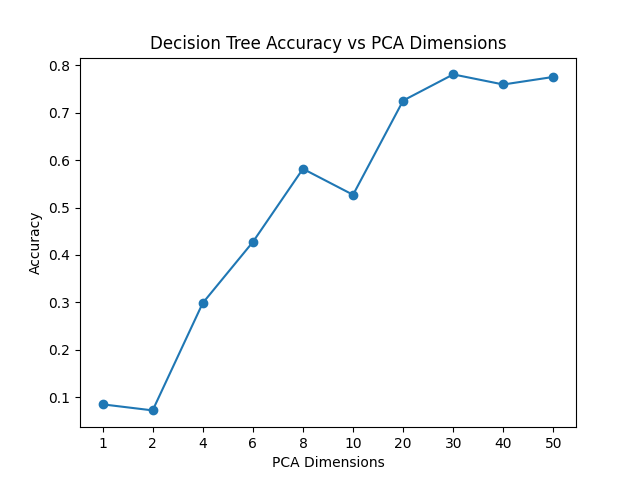
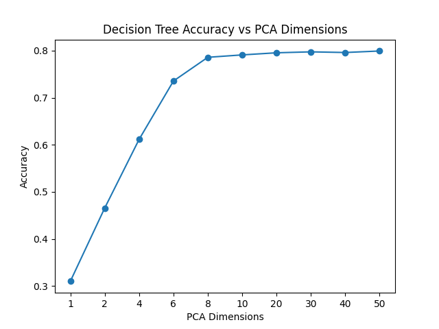

# MINIST数据集上的机器学习和深度学习方法比较
## 数据集介绍及预处理
MNIST数据集是一组手写数字的图像集，包含从0到9的数字，用于训练和测试机器学习模型。数据集通过load_data函数加载和预处理。该函数的主要任务是从给定的文件名加载MNIST数据集，并可选地应用PCA降维。数据集被分为训练集和测试集，每个数字类别的图像被组合在一起，形成单独的训练和测试数据集。

训练集和测试集的构建如下：对于每个数字类别（0到9），我们从对应的训练和测试子集中提取图像和标签。然后，这些图像被垂直堆叠以构成最终的训练和测试数据集。对于训练数据，使用PCA降维可以可选地应用，以减少数据的维度，这有助于提高计算效率和可能的模型性能。

## 算法介绍
线性SVM: 线性支持向量机（SVM）是一种强大的分类器，适用于高维数据。它试图找到一个超平面，以最大化不同类别数据点间的边界。

决策树: 决策树是一种简单直观的分类方法。它通过学习简单的决策规则从数据特征中进行分类。

简单卷积神经网络（SimpleCNN）:本报告使用的卷积神经网络（CNN）是一种简单的两层卷积结构。第一层卷积层将3个输入通道映射到16个输出通道，而第二层将这16个通道映射到32个通道，都使用了5x5的卷积核和2x2的最大池化。最后，通过一个全连接层将网络输出映射到10个类别。

线性SVM适用于处理高维数据，但可能在处理图像数据时不如基于图像特征的方法有效。决策树易于实现和解释，但通常不够准确，特别是在处理复杂的图像数据时。与之相比，SimpleCNN能够通过学习图像的空间特征来提供更精确的结果，尤其适合处理像MNIST这样的图像数据集。

特别是对于线性SVM，我们发现在处理大规模数据集时，模型可能存在收敛难度。为了应对这一问题，我们在模型中设置了最大迭代次数为1000。这个限制有助于防止模型在训练过程中过度耗时，同时确保了模型的有效性和计算效率。通过这种方式，我们能够在保持模型性能的同时，有效管理计算资源的使用。
## 结果比较和分析

  
   
  <em>图1：svm预测结果</em>

图:1是svm预测结果，可以看到，随着pca降维的维度提高，结果准确性提升，大约上升到在30维的时候，svm结果几乎没有变化，最终最高为79.95%。

  
   
  <em>图2：决策树预测结果</em>

图2是决策树预测结果，可以看到，随着pca降维的维度提高，结果准确性提升，大约上升到在40维的时候，svm结果几乎没有变化，最终最高为78.08%。

  
   
  <em>图3：cnn训练过程</em>

图3是卷积神经网络训练过程，最终在测试集的结果 99.04%。可以看出卷积神经网络更适合处理minist这种具有较强几何关系的数据，minist的准确率显著高于线性svm和决策树。
